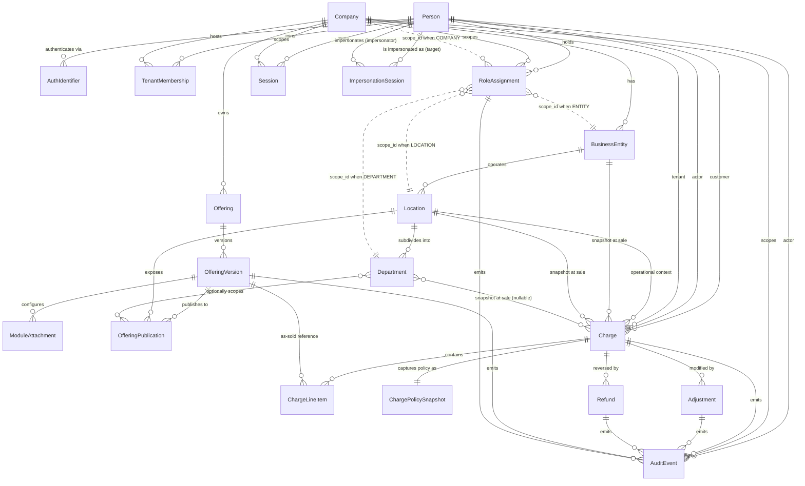

[DESIGN_TEMPLATE.md](https://github.com/user-attachments/files/27382074/DESIGN_TEMPLATE.md)
[Uploading DESIGN_TEMPLATE.md…]()
[PRIMITIVE_UnifiedUserModel.docx](https://github.com/user-attachments/files/27382065/PRIMITIVE_UnifiedUserModel.docx)
[PRIMITIVE_UnifiedOfferingModel.docx](https://github.com/user-attachments/files/27382063/PRIMITIVE_UnifiedOfferingModel.docx)
[PRIMITIVE_UnifiedChargeEngine.docx](https://github.com/user-attachments/files/27382061/PRIMITIVE_UnifiedChargeEngine.docx)
[PRIMITIVE_OrgHierarchy.docx](https://github.com/user-attachments/files/27382059/PRIMITIVE_OrgHierarchy.docx)
[PRIMITIVE_RELATIONSHIPS.md](https://github.com/user-attachments/files/27382075/PRIMITIVE_RELATIONSHIPS.md)# PRIMITIVE_RELATIONSHIPS.md

*Cross-primitive map for the FitFlow platform. Authoritative reference. Cite this document in every feature design.md.*

*Sources: PRIMITIVE_UnifiedUserModel, PRIMITIVE_OrgHierarchy, PRIMITIVE_UnifiedOfferingModel, PRIMITIVE_UnifiedChargeEngine.*

---

## 1. Entity-Relationship Diagram

> Mermaid notes: `||--o{` = one-to-many. `}o..||` = many-to-one logical reference (no FK constraint, app-enforced). `}o--o{` = many-to-many or optional many-to-one. AuditEvent fan-in is shown selectively for the major emitters; in practice every primitive emits.

---

## 2. Cross-Primitive Invariants

These are rules that span two or more primitives. None of them live inside a single primitive's spec — they emerge at the boundaries. Every prototype must respect them.

### 2.1 Financial integrity (UCE × OH)

| ID | Invariant | Enforcement point |
|---|---|---|
| XPI-FIN-01 | A Charge cannot commit if `Location.business_entity_id` is null. | UCE commit (HTTP 500, blocked, alerted) |
| XPI-FIN-02 | A Charge cannot commit if the BusinessEntity has no active `bank_account_config_id`. | UCE commit pre-validation |
| XPI-FIN-03 | A Location cannot be deactivated while it has unsettled Charges or future Bookings. | OH deactivation guard |
| XPI-FIN-04 | `business_entity_id_at_sale`, `location_id_at_sale`, `department_id_at_sale` are immutable after commit. Reconciliation always uses these snapshots, never current org assignments. | DB UPDATE trigger on Charge / Refund / Adjustment |
| XPI-FIN-05 | A BusinessEntity cannot be deactivated while it has active Locations or unsettled Charges. | OH deactivation guard (implied; tighten in design) |

### 2.2 Catalog integrity (UCE × UOM)

| ID | Invariant | Enforcement point |
|---|---|---|
| XPI-CAT-01 | Every `ChargeLineItem` references an `offering_version_id` (never `offering_id`). | UCE commit validation |
| XPI-CAT-02 | The referenced OfferingVersion must be in `PUBLISHED` status at commit time, OR the commit must be a recurring renewal whose original commit referenced a version that has since been retired. (Recurring renewals against retired versions need explicit handling — see open question.) | UCE commit validation |
| XPI-CAT-03 | An Offering cannot be published without at least one OfferingPublication targeting an active Location whose BusinessEntity has active bank/tax config. | UOM publish validation |
| XPI-CAT-04 | OfferingVersion immutability is honored: a Charge committed on Mar 1 against v3 must continue to display v3's price/policy fields forever, even after v4 is published. | UI display rule + DB immutability |

### 2.3 Identity, scope, and access (UUM × OH × everywhere)

| ID | Invariant | Enforcement point |
|---|---|---|
| XPI-AUTH-01 | Every privileged API call validates the actor's `RoleAssignment` against the requested scope. Client-supplied scope headers are hints only. | API middleware |
| XPI-AUTH-02 | Default-deny: a Person with no active RoleAssignment in a tenant has zero access to that tenant's data. | RLS + RBAC layers |
| XPI-AUTH-03 | SoD pairs (SECURITY_ADMIN+FINANCE_ADMIN, SECURITY_ADMIN+TAX_BANK_CONFIG_ADMIN, FINANCE_ADMIN+TAX_BANK_CONFIG_ADMIN) cannot be assigned to the same person at the same scope. Validated per-item. | RoleAssignment service (HTTP 409 on conflict) |
| XPI-AUTH-04 | RoleAssignment.scope_id must reference a row of the type implied by scope_type (LOCATION → Location, etc.). Not enforced at DB; enforced at app layer. | Role assignment service |
| XPI-AUTH-05 | An ImpersonationSession cannot grant access beyond the target Person's active RoleAssignments. | Impersonation middleware |
| XPI-AUTH-06 | Impersonation actions emit AuditEvents with dual attribution (impersonator + target). | Audit emit layer |

### 2.4 Audit trail (everything → UUM.AuditEvent)

| ID | Invariant | Enforcement point |
|---|---|---|
| XPI-AUD-01 | Every state-changing operation across all four primitives emits an AuditEvent. AuditEvents are append-only and immutable. | DB constraint + service layer |
| XPI-AUD-02 | AuditEvent payloads are PHI-safe — IDs and hashes, not raw PII. Before/after values use a per-field allowlist. | Audit emit layer |
| XPI-AUD-03 | AuditEvent retention is minimum 3 years per company audit retention policy. | Retention job |
| XPI-AUD-04 | Every committed Charge has at least one corresponding `charge.committed` AuditEvent. Reconciliation reports cross-check this. | UCE commit + reconciliation job |

### 2.5 Idempotency and concurrency (UCE × UCE)

| ID | Invariant | Enforcement point |
|---|---|---|
| XPI-IDM-01 | All UCE write operations (Commit, Adjustment, Refund) require an `idempotency_key`. Duplicate key returns the existing record — no new record created. | API validation |
| XPI-IDM-02 | Concurrent commits for the same booking: first wins. Second returns HTTP 409 unless the idempotency_key matches. | UCE commit |
| XPI-IDM-03 | Over-refund is blocked: `refund.amount ≤ charge.customer_due − sum(prior refunds)`. Validated before any payment-processor call. | UCE refund pre-validation |

### 2.6 Reporting dimensions (UOM → UCE)

| ID | Invariant | Enforcement point |
|---|---|---|
| XPI-RPT-01 | `category`, `tax_category`, `revenue_category` are required on OfferingVersion at publish, and copied immutably onto each ChargeLineItem at commit. | UOM publish + UCE commit |
| XPI-RPT-02 | A reporting dimension cannot be deleted while referenced by any active OfferingVersion. | UOM dimension service |

---

## 3. Common Compositions Cheat Sheet

For each major flow, the entities involved across primitives. Use this as the starting checklist when designing a feature.

### 3.1 Member checkout (web booking)

| Primitive | Entities involved |
|---|---|
| UUM | Person (customer), Session, AuthIdentifier (verified) |
| OH | Location (operational), BusinessEntity (resolved at commit), Department (optional) |
| UOM | OfferingVersion, OfferingPublication (must be active for this Location + WEB channel), ModuleAttachments (drive availability/capacity) |
| UCE | Charge (new), ChargeLineItem (one or more), ChargePolicySnapshot, customer payment via Payments Domain |
| Audit | `charge.committed` |

### 3.2 POS sale (front-desk)

| Primitive | Entities involved |
|---|---|
| UUM | Person (customer; may be guest), Person (actor=staff), Session, RoleAssignment (FRONT_DESK_STAFF at this Location) |
| OH | Location, BusinessEntity, Department (optional) |
| UOM | OfferingVersion, OfferingPublication (Location + POS channel) |
| UCE | Charge, ChargeLineItem(s), ChargePolicySnapshot |
| Audit | `charge.committed` |

### 3.3 Refund

| Primitive | Entities involved |
|---|---|
| UUM | Person (actor), RoleAssignment (FRONT_DESK_STAFF for partial below threshold; LOCATION_MANAGER+ for full or above threshold), Session (step-up if above threshold) |
| OH | Location (must match Charge's `location_id_at_sale` for scope check) |
| UOM | OfferingVersion (referenced for receipt redisplay only — not modified) |
| UCE | Charge (referenced, not modified), Refund (new), idempotency_key, over-refund guard |
| Audit | `refund.created`, `refund.completed` |

### 3.4 Adjustment (no-show, goodwill, save-offer)

| Primitive | Entities involved |
|---|---|
| UUM | Person (actor), RoleAssignment (LOCATION_MANAGER+ typically), reason_code from controlled vocabulary |
| OH | Location (scope check) |
| UCE | Charge (referenced, not modified), Adjustment (new), optional ChargeLineItem reference for line-item-level |
| Audit | `adjustment.created` |

### 3.5 Offering publish

| Primitive | Entities involved |
|---|---|
| UUM | Person (actor=Company Admin), RoleAssignment (COMPANY_ADMIN), Session |
| OH | Locations (target publication scope), BusinessEntities (must have active bank+tax config), Departments (optional scoping) |
| UOM | Offering, OfferingVersion (DRAFT → PUBLISHED), ModuleAttachments (per type-module matrix), OfferingPublications (one per target Location), reporting dimensions, validation engine output, config_hash |
| Audit | `offering.published`, prior version's `offering.retired` |

### 3.6 Role assignment

| Primitive | Entities involved |
|---|---|
| UUM | Person (actor=SECURITY_ADMIN), Person (subject), RoleAssignment (new), SoD validator, reason_code |
| OH | Scope target (Company / BusinessEntity / Location / Department) |
| Audit | `role.assigned` |

### 3.7 Staff invite

| Primitive | Entities involved |
|---|---|
| UUM | Person (actor=COMPANY_ADMIN or SECURITY_ADMIN), Person (new or existing — dedupe runs), TenantMembership (status=INVITED, 72h expiry), AuthIdentifier (created on accept), RoleAssignment (created on accept) |
| OH | Tenant + initial scope assignment |
| Audit | `user.invited`, then on accept: `tenant_membership.activated`, `role.assigned` |

### 3.8 Person merge (dedupe resolution)

| Primitive | Entities involved |
|---|---|
| UUM | Person (primary), Person (secondary, gets `merged_into_person_id`), DedupeCandidatePair, AuthIdentifiers (re-pointed to primary), RoleAssignments (re-pointed), Session (step-up required) |
| UCE | **No rewriting** — historical Charges retain original attribution per UUM-DUP-004 |
| Audit | `person.merged` with full diff |

### 3.9 Configuration rolldown

| Primitive | Entities involved |
|---|---|
| UUM | Person (actor=COMPANY_ADMIN), RoleAssignment |
| OH | Company (template scope), Locations (target scope), Variance Report |
| UOM | Potentially: OfferingPublications, pricing modules, policy packs |
| Audit | `config.template_published`, `config.override_applied` |

### 3.10 Reconciliation export

| Primitive | Entities involved |
|---|---|
| UUM | Person (actor=FINANCE_ADMIN with step-up), Session |
| OH | BusinessEntity (the export is per-entity), period range |
| UCE | Charges, ChargeLineItems, Adjustments, Refunds — filtered by `business_entity_id_at_sale` (snapshot, not current) |
| Audit | `export.generated` with parameters and integrity hash |

### 3.11 Member check-in

| Primitive | Entities involved |
|---|---|
| UUM | Person (member), Session (or shared-device PIN), Person (actor=staff if assisted) |
| OH | Location |
| UOM | OfferingVersion (entitlement check) |
| UCE | (No new Charge unless drop-in fee) — entitlement consumption |
| Audit | `checkin.recorded` |

---

## 4. Open Questions Log

Surfaced from drawing the cross-primitive connections. These are real gaps that affect design — not nitpicks.

| # | Question | Affected primitives | Surfaces in |
|---|---|---|---|
| OQ-01 | UCE.Charge.channel includes `BILLING_JOB` and `API`, but UOM.OfferingPublication.channels only allows `WEB │ POS │ ADMIN`. How does a recurring-billing job validate against publication scope? | UCE × UOM | Membership renewal flows |
| OQ-02 | What happens when a recurring charge fires against an OfferingVersion that has since been retired? Does the renewal pin to the original version forever, or migrate to the current published version? | UCE × UOM | Membership lifecycle |
| OQ-03 | Member portal scope: when a Person has memberships at multiple Locations, what's the canonical "current location" for the member experience? Is there a `home_location_id` on TenantMembership? | UUM × OH | Member dashboard |
| OQ-04 | Guardian-to-minor relationship: there's no schema link between a guardian Person and the minor Person they act for. Is there a missing `GuardianRelationship` entity? | UUM | Guardian-led booking, minor consent |
| OQ-05 | RoleAssignment.scope_id has no FK constraint matching scope_type. Should this be a tagged-union, separate columns per scope, or an enforced application-layer check? | UUM × OH | Role assignment UI, audit |
| OQ-06 | Session has no `active_scope_type` / `active_scope_id`. A multi-location LOCATION_MANAGER needs to switch scope. Where is the active scope persisted across requests? | UUM × OH | Scope picker, every authenticated request |
| OQ-07 | PACKAGE_CREDIT_PACK redemption mapping is required by UOM-CM-004 but not schematized. What entity expresses "this pack's credits redeem against CLASS offerings of category=Yoga"? | UOM | Credit pack creation, redemption at booking |
| OQ-08 | When a re-publish produces an identical config_hash (no real config changes), is that a no-op, a new version, or blocked? | UOM | Publish UX |
| OQ-09 | ChargePolicySnapshot.rules_json captures rules but no scope context. If pricing policies are scoped per Location/Entity, the snapshot needs to say which scope it captured. | UCE × UOM × OH | Charge audit, dispute evidence |
| OQ-10 | Zero-priced RETAIL offerings vs. comp-posture Charges produce similar customer-facing outcomes but report differently. What's the operator guidance on which to use? | UOM × UCE | POS UX, reporting |
| OQ-11 | Location timezone migration is mentioned as a workflow but undefined. What does the snapshot preservation look like for charges committed under the old timezone? | OH × UCE | Operations admin |
| OQ-12 | VOIDED Charges: who can void, what triggers it, what AuditEvent type, what cascades to bookings/entitlements? Currently underspecified. | UCE | POS, member cancellation |
| OQ-13 | Department-level RoleAssignments (INSTRUCTOR_COACH, DEPARTMENT_LEAD) — does access to a Department implicitly grant any Location-level read? Or must they have separate Location-scoped roles for cross-department visibility? | UUM × OH | Sidebar nav, schedule views |
| OQ-14 | OfferingPublication.local_override_allowed enables Location Managers to set local price/schedule. Where does that override live — on the Publication row, on a separate override entity, or as a derived OfferingVersion? | UOM × OH | Local override UX |
| OQ-15 | The style guide is calibrated for member surfaces. Admin-density needs (schedule grids, audit logs, reconciliation tables) require either a guide extension or a documented density variant. | Design system | Every admin prototype |

---

*End of PRIMITIVE_RELATIONSHIPS.md. Treat as authoritative reference. Update only when invariants change or open questions are resolved — and audit the change.*
